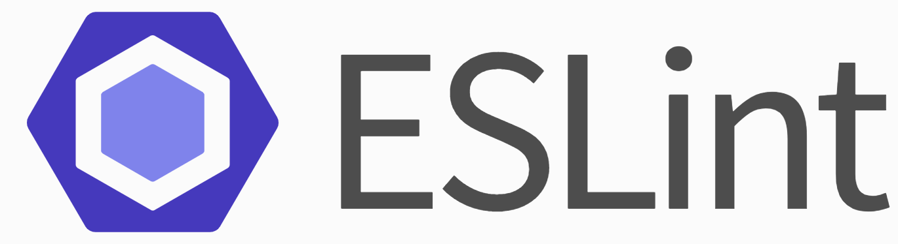

# **The Power of ESLint and Coding Standards**

  

## **Redefining Coding Standards: Beyond the Trivialities**

In the realm of software development, coding standards often conjure images of trivialities—mere standards dictating indentation or brace placement. However, I contend that these standards harbor a deeper significance, going beyond mere aesthetic preferences. While consistency in coding style is undoubtedly beneficial for collaborative projects, the true value of coding standards lies in the capacity to enhance code readability, maintainability, and even facilitate learnability.

## **Learnability Through Coding Standards**

An interesting revelation, coding standards can serve as tool for learning how to code. By adhering to standardized conventions, novice programmers are exposed to best practices and expressions of a language. For instance, consistent naming conventions not only enhance code clarity but also reinforce the vocabulary used within the programming language. Moreover, adherence to coding standards cultivates a disciplined approach to coding, fostering habits of organization and clarity crucial for mastering any language.

## **Harnessing the Power of ESLint with IntelliJ: A First-Week Reflection**

At the start of my first week of utilizing ESLint integrated into IntelliJ, I anticipated an annoying sidekick pestering me on proper formatting and hindering me on the speed at which I could code. However, my initial impressions has thwarted those expectations. The experience of the elusive green checkmark revealing itself at the top right of my screen has been a blend of nervousness and satisfaction. Already I begun to understand the difference in readability that ESLint guided me to achieve, and I find myself consistently agreeing with the errors it points out, taking note to not make such mistakes again.

### **Obstacles and Progress**

At times, the errors of ESLint posed to be an obstacle, revealing inconsistencies and shortcomings in my coding style. On occasion, I would be confronted with a barrage of warnings and errors, and frustration threatened to overshadow my coding progress. However, each correction, no matter how trivial, propelled me toward a deeper understanding of coding standards and their impact on code quality. Even the initial installation of ESLint made my head spin; after hours of attempting to solve an error-exception, it was revealed to me that I was referencing the wrong file due to some lazy copy-pasting.

### **Insights**

Yet amidst the red underlines, ESLint has unveiled a bounty of insights. Beyond adherence to stylistic conventions, ESLint serves as a guard, alerting me to potential pitfalls and vulnerabilities lurking within my code. From identifying unused variables to enforcing consistent variable declarations, ESLint acts as a silent mentor, guiding me toward cleaner, more maintainable code.

## **The Transformative Potential of Coding Standards**

As I continue my journey with coding standards and ESLint, I am reminded of their transformative potential. Beyond mere tools for enforcing consistency, coding standards serve as catalysts for growth and mastery. From novice programmers seeking language proficiency to seasoned veterans striving for code excellence, adherence to coding standards is the hallmark of a disciplined, conscientious developer. While coding standards may appear trivial on the surface, their impact transcends stylistic preferences. From deepening knowledge on a language's tendencies to fostering code clarity and maintainability, coding standards are indispensable tools for any developer's arsenal. As I charge through the barrage of ESLint warnings and errors, I am reminded that the pursuit of the green checkmark is not merely a quest for compliance, but a journey toward coding excellence.

ChatGPT was used in assistance of creating this page