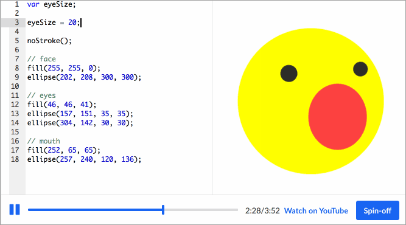

## The Beginning
The very first time I used Javascript was at the age of 10, learning how to code on Khan Academy. Though I never learned to the extent of building fully functional applications, I was able to create simple programs that satiated my curiosity on how programs worked. I often would look into the code of the most popular programs posted on Khan Academy’s forums and change random lines with my own. This early exposure sparked my interest in Computer Science that would be my drive and passion to get me to where I am today.

## Here and Now
Thus far in ICS 314, I have gotten a renewed sense of javascript. As I haven't touched it in the last decade, I had forgotten the little I knew, and was a bit intimidated by the 100+ problems assigned to us over the weekend. This fear fleeted as I worked through each problem, and I soon realized how convenient Javascript makes it for programmers. Unlike the languages I used so far, Javascript tends to simplify syntax for the user’s convenience, instead of the typical strictness that adheres to the computer’s processing. It was particularly interesting that Javascript had an update like ES6 that furthered its convenience while also addressing previous issues. Compared to C that has seen pretty much no syntax update and only minor tweakage to improve compiling. Javascript is really an ‘abc’ coding language, but just like the alphabet, you can use it to build nearly anything you can think of.

## What the WOD?
The WODs are truly beneficial to a student like me; when it comes to learning how to use a coding language, I best learn when I put coding into practice, instead of reading a book or listening to a lecture. I also appreciate that it simulates real-world environments, where we can utilize the internet, but still limited to our personal knowledge due to time constraints. Additionally, the time limit builds a stressed situation that allows us to get used to time crunches and high priority issues that need to be addressed immediately. I look forward to our first official WOD tomorrow and the many we’ll take over the semester.

## And so...
All in all, Javascript is a great language to begin utilizing, especially with the context of this course and the WODs. Its user friendliness allows us to quickly pick it up and focus on the more important thought-processing that goes into coding as well as help quickly produce visible results for us to gauge how our code is functioning.  I am excited to continue to learn more about Javascript, as well as how we’ll utilize it in our professional portfolios.

