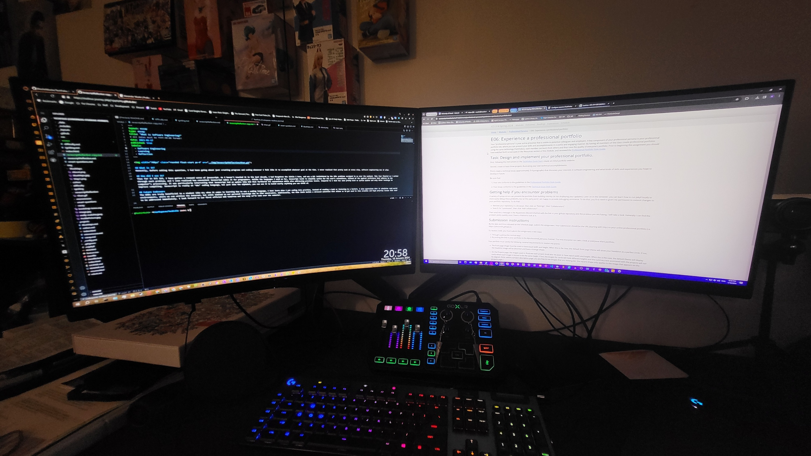

## **Unveiling the Essence of Software Engineering**

### **Understanding its Influence**
In my prior approach to programming, the role of software engineering often eluded me as I coded sporadically to meet specific needs. It was only when I pondered the question, "What is it?" that I began to grasp the pervasive influence of software engineering, realizing its impact at every juncture of the development process.

### **Realization through Reflection**
As I delved into this question, the abstraction of software engineering gave way to the practical act of creating software. Reflecting on my journey, I recognized my unwitting involvement in software engineering, both as a student and in personal projects. This revelation underscored the importance of structured and systematic approaches to software development.

### **Aspirations and Future Pursuits**
Looking forward, my aspirations extend to a deeper exploration of the technical facets of software engineering. The goal is to acquire a comprehensive understanding of its underlying concepts and methodologies. Beyond understanding, I aim to apply this knowledge to revisit and enhance my past projects, modernizing them by adhering to proper coding standards. This commitment ensures the longevity and sustainability of their functionality.

### **The Unfolding Journey**
The exploration of software engineering's essence has not only exposed its omnipresence in my past endeavors but has also ignited a desire to deepen my knowledge and apply it to future projects. The ongoing pursuit of technical proficiency and the commitment to modernize existing work encapsulate my evolving relationship with the field of software engineering.
From uncovering the outer layers of software engineering, to understanding its impact to shaping a future intertwined with its principles, I look forward to learning more about software engineering this year.