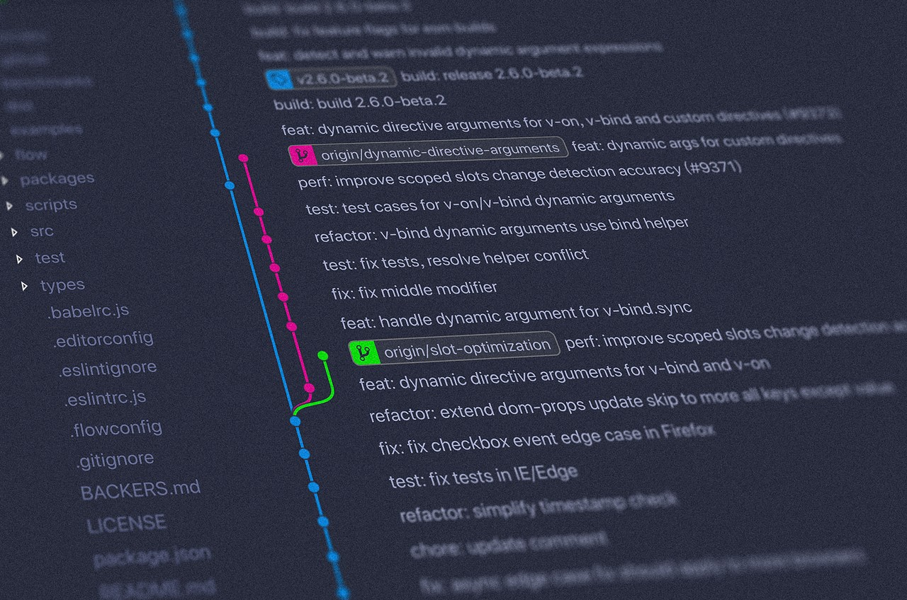

## The Beginning

When I first started my semester in ICS 314 [Software Engineering I], I came in with a rudimentary understanding of software development, and expectations of learning how to create, develop, and deploy more fully-featured software. Little did I know that this course would encompass a vast array of disciplines, methodologies, and tools, majority of which, while associated with web development, taught to a capacity that expanded beyond the coursework; relevant and impactful to the modern essence of software engineering and implemented skillsets that would be a permanent part of my coding repertoire. Specifically, I'll elaborate on the concepts of Open Source Software Development and Functional Programming: what these mean, their key practices, and how they can be applied beyond web development.

## Open Source Software Development



### What is OSSD?

Open Source Software Development is the practice of developing software whose source code is openly accessible. This means that anyone can inspect, modify, and distribute the code. This provides a framework that encourages the public to contribute to a shared repository. This creates a more diverse and resilient ecosystem of software solutions since the code now can pass hundreds of eyes to check, modify, and troubleshoot the code.

### How is it used?

Open source software is widely utilized today, from small hobby projects to enterprise-grade applications. Some notable examples include the Linux operating system, the Apache web server, and programming languages like Python. Contributors to these projects range from individual hobbyists to professionals employed by tech giants. Contributions may include bug fixes, feature enhancements, or entirely new modules. Open Source Software Development also promotes a culture of code reuse, where high-quality, reusable components can be easily integrated into new or existing projects.

### Beyond Web Development

The influence of OSSD extends beyond traditional web development. For instance, in scientific computing, open source tools like R and Python's data science libraries are invaluable for researchers working in diverse disciplines. In embedded systems, open source platforms like Arduino have democratized hardware prototyping, allowing developers to innovate in robotics, IoT, and other fields. Open source's collaborative culture means it is continually shaping emerging domains like artificial intelligence, where frameworks like TensorFlow are becoming essential tools for machine learning research and applications.

## Functional Programming

### Functional Programming vs Programming Functions

Functional programming is a paradigm that treats computation as the evaluation of mathematical functions and avoids changing state or mutable data. This is in contrast to normal functions, which simply refers to organizing code into reusable subroutines. Functional programming emphasizes immutability, first-class functions, and expressions over statements.

### Key Principles

1. **First-Class Functions**: Functions are treated as first-class entities, meaning they can be passed around as arguments, returned from other functions, and assigned to variables.
2. **Immutability**: Data structures are immutable, ensuring that once created, their state cannot be altered.
3. **Pure Functions**: Functions that always produce the same output for the same input and have no side effects.
4. **Recursion**: Instead of loops, recursion is used for iteration, often in conjunction with higher-order functions like `map` and `reduce`.
5. **Declarative Style**: Focuses on the *what* rather than the *how*, making code more concise and expressive.

```js
// Functions are treated as first-class entities
const add = (x, y) => x + y;
const subtract = (x, y) => x - y;

// Functions are passed around as arguments
const applyOperation = (operation, x, y) => operation(x, y);

// Functions are returned from other functions
const getOperation = (operator) => {
    if (operator === '+') return add;
    else if (operator === '-') return subtract;
};

// Functions can be assigned to variables
const operation = getOperation('+');

// Data structures are immutable
const originalArray = [1, 2, 3];

// Instead of modifying the original array, a new array is created
const newArray = originalArray.map(x => x * 2);

// This function always produces the same output for the same input
const square = (x) => x * x;
const result = square(4); //= 16 | and the result will always be consistent

// Focuses on what needs to be done rather than how
// The 'map' function applies the square function to each element of the array
const squaredNumbers = [1, 2, 3, 4, 5].map(square);

// The 'reduce' function is used to sum up all elements of the array
const sum = [1, 2, 3, 4, 5].reduce((acc, curr) => acc + curr, 0);
```

## Applications in Software Development

Both Open Source Software Development and Functional Programming are powerful methodologies that can be applied in different project contexts. For instance, in data processing or financial systems where reliability is critical, the immutability and purity of functional programming reduce bugs related to shared state or unexpected mutations. Functional programming can also be applied in concurrent programming, as its statelessness simplifies parallel execution.

In the open source realm, developers can leverage a wide array of libraries to build more sophisticated applications without reinventing the wheel. Additionally, the open nature of these projects helps teams learn from others, build expertise, and gain recognition through their contributions.

## To Conclude

Open Source Software Development and Functional Programming represent two transformative trends in the field. Open source encourages global collaboration and knowledge sharing, while functional programming provides a fresh perspective on writing reliable and elegant code. Together, they enrich the software development process, fostering creativity and resilience in tackling today's and tomorrow's challenges.