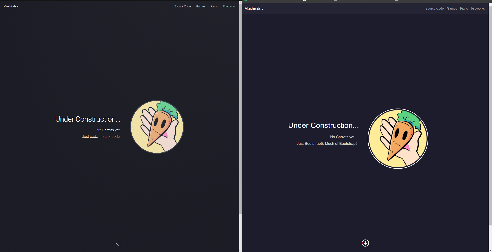

# **The Case for UI Frameworks: Embracing Efficiency and Consistency**

UI frameworks like Bootstrap5 often find themselves at the heart of a heated debate in the web development community. On one side, there are purists who argue for the simplicity and purity of raw HTML and CSS, advocating for handcrafted, bespoke designs. On the other side, proponents of UI frameworks tout their efficiency, consistency, and time-saving advantages. So, where does the truth lie amidst this contention?

To begin with, let's acknowledge the complexity of UI frameworks. They can indeed present a steep learning curve, akin to picking up a new programming language. But here's the crucial distinction: while learning a programming language expands your capabilities as a developer, mastering a UI framework streamlines your workflow and enhances your productivity.

So, why should one bother with the investment of time and frustration that comes with learning a UI framework like Bootstrap5? The answer lies in the manifold benefits it offers.

## **Rapid Prototyping and Component Reusability**

Firstly, UI frameworks provide a comprehensive set of pre-designed components and styles, allowing developers to rapidly prototype and build interfaces with minimal effort. This means no more reinventing the wheel for common UI elements like buttons, forms, and navigation bars. With Bootstrap5, for instance, you have a wealth of meticulously crafted components at your disposal, all following best practices for accessibility, responsiveness, and cross-browser compatibility.

## **Ensuring Design Consistency**

Secondly, UI frameworks enforce consistency across your project, ensuring that your application maintains a cohesive look and feel throughout. This is particularly valuable for teams working on large-scale projects, where maintaining design consistency can become a significant challenge. By adhering to the conventions and guidelines set forth by the framework, developers can streamline collaboration and facilitate seamless integration of new features.

## **Streamlined Development with Powerful Utilities**

Moreover, UI frameworks often come equipped with powerful utilities and tools that simplify common tasks such as grid layout, typography management, and responsive design. Bootstrap5, for example, introduces a new grid system based on Flexbox, offering unparalleled flexibility and control over your layout.

## **Fostering Collaboration and Extensibility**

But perhaps the most compelling argument in favor of UI frameworks is the ecosystem they foster. Beyond the core framework itself, there exists a vibrant community of developers contributing plugins, themes, and extensions that extend its functionality even further. This rich ecosystem not only accelerates development but also fosters collaboration and knowledge-sharing among developers worldwide.

## **Why Not Just Stick to Raw HTML and CSS?**

Now, let's address the elephant in the room: why not just stick to raw HTML and CSS? While it's true that hand-coding your styles can offer greater control and flexibility in certain scenarios, it comes at a cost: increased development time, heightened risk of inconsistencies, and a steeper learning curve for newcomers to the project. UI frameworks like Bootstrap5 strike a delicate balance between flexibility and convenience, empowering developers to focus on solving higher-order problems rather than getting bogged down in the nitty-gritty of styling.

## **A Simple example:**

Finally, I myself have recently experienced first hand these advantages to UI frameworks and utilizing Bootstrap5. Take note of these two webpages: 

  

On the left is my personal website, utilizing a UI framework HTML5, but was used strictly as a template as I had little to no experience with the HTML5 library and tools that it offered; essentially, I had filled in the information I wanted, and for any additions, had to rely on my proprietary skillset of basic html and css. The process of adding new pages, content, and sections took hours or days to get close to what I desired my site to appear as. On the right is a recreation of the main page made in less than an hour with Bootstrap5. After only a week of learning the basics, I already had the capabilities to utilize the tools of Bootstrap5 to create a design exactly the way I wanted it in rapid development. 

## **Conclusion**

While UI frameworks may present their fair share of challenges, the benefits they offer far outweigh the costs. From rapid prototyping to ensuring design consistency and fostering collaboration, frameworks like Bootstrap5 have become indispensable tools in the modern web developer's arsenal. So, the next time you find yourself grappling with the decision of whether to embrace a UI framework, remember this: the upfront investment of time and effort will pay dividends in the long run, enabling you to build better, more maintainable web applications.

ChatGPT was used in assistance of creating this page