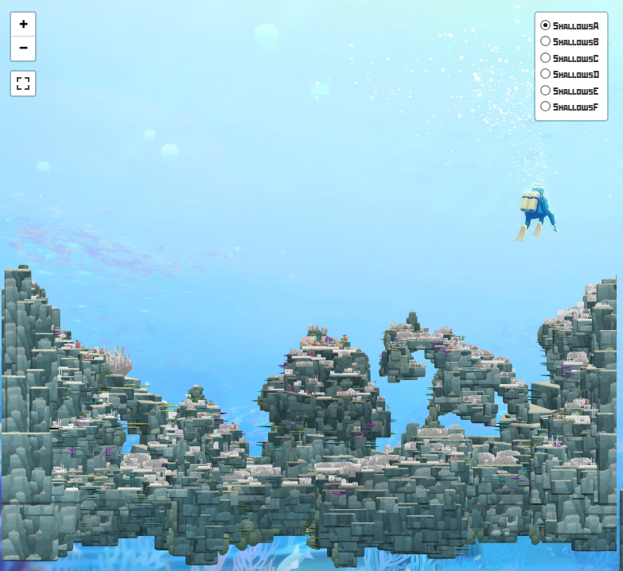

  
  

BlueMaps is an interactive map of the Blue Hole from Dave the Diver! It was created with a combination of HTML, CSS, and Javascript. 
Leaflet was used for the map function and the maps were created by datamining the game and opening the project files in Unity. 
Additionally, I recieved permission to include KlinkerKlank's original map which inspired this project. Check out the site at [bluemaps.moshir.dev](https://bluemaps.moshir.dev/)!

You can learn more at the [BlueMaps Repository Page](https://github.com/MoshirMoshir/BlueMaps).
