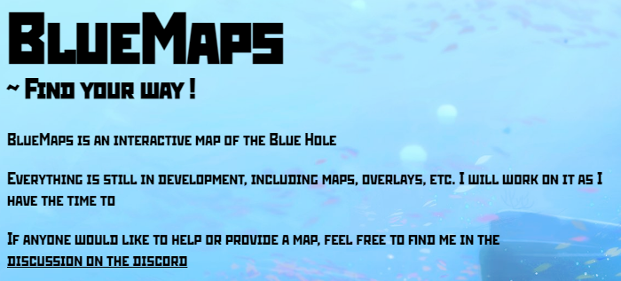

  

## BlueMaps: Navigating the Depths with Technology

BlueMaps is an engaging and interactive map showcasing the Blue Hole from Dave the Diver. Crafted with a blend of HTML, CSS, and Javascript, this project represents the use of languages on a static website to create a functioning and useful webapp.

### Development Highlights:

- **Interactive Interface**: Leveraging HTML, CSS, and Javascript, the development process focused on seamlessly embedding an image and implementing intuitive navigation, providing users with a smooth and immersive map-like experience.

- **CSS Magic**: CSS played a pivotal role in enhancing site functionality and optimizing sitemap navigation, contributing to a polished and user-friendly interface.

- **Leaflet Integration**: To elevate the map's user interface, Leaflet was strategically employed, offering a robust set of functions that seamlessly integrated with the project's goals.

- **Data Magic**: The maps were meticulously datamined from game files and skillfully edited to ensure ease of use, creating a visually captivating and informative environment for users.

### Future Roadmap:

There are exciting plans in the pipeline for BlueMaps, promising even more enriching experiences. Explore the project's evolution and contribute to its growth by visiting the [BlueMaps Repository Page](https://github.com/MoshirMoshir/BlueMaps).

### Experience BlueMaps Now:

Visit [bluemaps.moshir.dev](https://bluemaps.moshir.dev/) and dive into the immersive world of Dave the Diver. Experience the convenience of a digitalized map and use it to help your exploration of the Blue Hole!

  <embed src="https://bluemaps.moshir.dev/map.html" style="width:900px; height: 800px;">

ChatGPT was used in assistance of creating this page