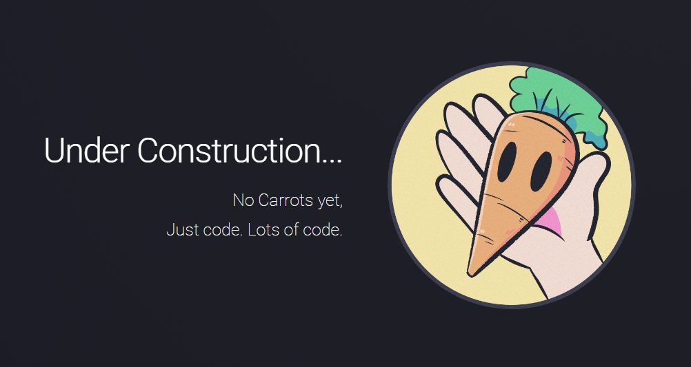

  

[https://moshir.dev/](https://moshir.dev/) is my personal website I started on the 24th of July 2022. It has progressively evolved (archive picutres to be found and uploaded soon) since then as I progressed in my knowledge of HTML, CSS, and Javascript. Currently it holds many profile links, a page for the games I've worked on, a page for Piano music I compose, and a fun project I found and decided to add to the site called "Fireworks". I am hoping to continue to work on this site and eventually turn it into my official page as both a portfolio, and to find resources on everything I've worked on publically.

ChatGPT was used in assitance of creating this page