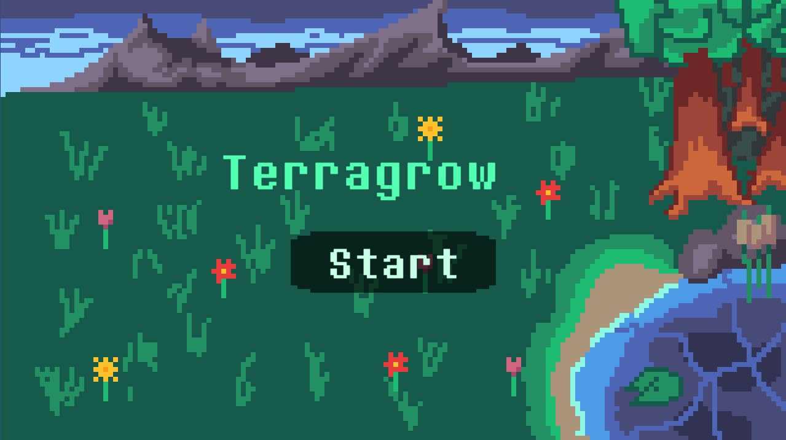

  

Don't expect much as we did this completely on our own working a total of 18 hours across 3 days for the game jam. 

This was an amazing experience and the first step in my journey to learn how to game dev! I would appreciate any kind of feedback and constructive criticism that you could provide, particularly with what was done well and what could have been done better. Though I hope at the very least you enjoy yourself and have fun!

If you'd like to check out the game, play it on [moshir.itch.io/terragrow](https://moshir.itch.io/terragrow)!
