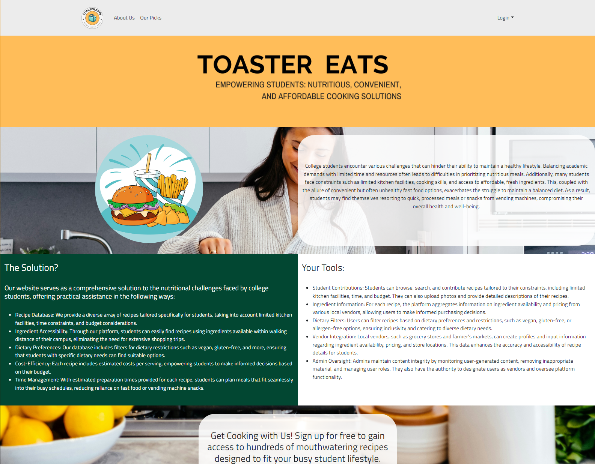
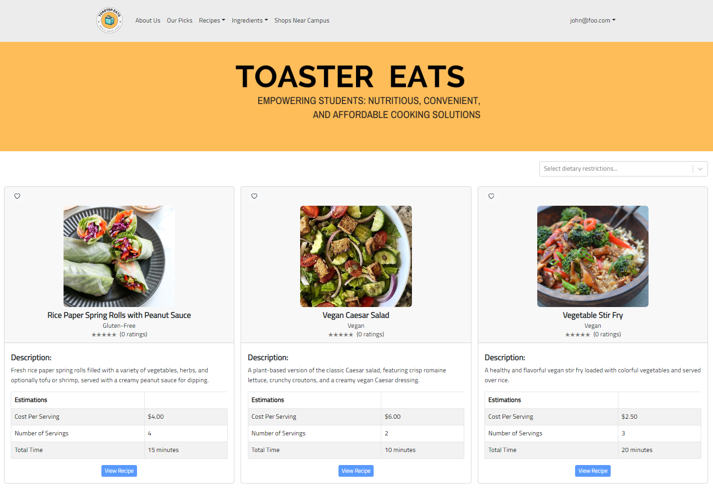
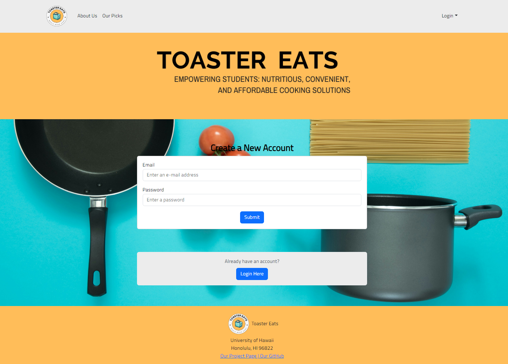

## Toaster Eats

Toaster Eats is a web application aimed at improving the nutritional content and variety of foods eaten by students, offering realistic alternatives to vending machine and fast food products.

### Overview

Toaster Eats utilizes several frameworks including Meteor for JavaScript-based implementation of client and server code, React for component-based UI implementation and routing, and React Bootstrap CSS Framework for UI design.

With a variety of pages, a few highlights are:
- **Landing Page**
  

    
  
  

- **Recipes Page**
  

    
  

- **Sign Up Page**
  

    
  

### Deployment

You can check out the live deployment at [Toastereats.today](https://toastereats.today)

### Milestones

During the entire building process, our team tracked each major milestone on GitHub Project Pages and integrated issues in order to easily assign, track, and complete application and feature implementations.
- [Milestone 1](https://github.com/orgs/Toaster-Eats/projects/2)
- [Milestone 2](https://github.com/orgs/Toaster-Eats/projects/3/views/1)
- [Milestone 3](https://github.com/orgs/Toaster-Eats/projects/4/views/1)

### About the Team

You can find out more information about the team here:
- [Kenneth de Guzman](https://k-deguz.github.io/)
- [Alexander Moshir](https://techfolio.moshir.dev/)
- [Kenneth Seekins](https://kseekins.github.io/)
- [Baishen Wang](https://baishenwang.github.io/)
- [Christopher Yamada](https://citycoding.github.io/)

You can also view the ToasterEats GitHub organization here: [Toaster-Eats](https://github.com/Toaster-Eats)
